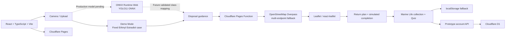

# MediCycle AI

> **Recognize the medicine. Activate better choices.**

MediCycle is a competition prototype that turns medication disposal into a clear, guided action. It combines a camera/upload experience, disposal guidance, nearby-pharmacy discovery, and ocean-impact learning to help users connect one household decision with a wider environmental outcome. The current release presents a transparent fixed demonstration case while the production medication-recognition model is still being trained and validated.

中文簡介：MediCycle 透過藥物處理引導、附近藥局搜尋與海洋教育，把正確回收行動轉化為容易理解且可持續的互動流程。


## Product Walkthrough

### Fixed Demo result and disposal guidance

The current Demo Mode uses an Ethinyl Estradiol 0.03 mg case. The result is deliberately labeled as a fixed case—not as an identification of the user's photo—and provides a step-by-step professional return plan.


### Marine Life collection

Completing the guided disposal simulation unlocks marine life cards, making the environmental consequence of a small household action visible and memorable.


## Features

- **Demo Mode** — runs one clearly labeled Ethinyl Estradiol case so the complete competition journey can be demonstrated without presenting simulated output as live AI.
- **Camera and upload** — supports camera capture, file selection, drag-and-drop, local preview, file-type validation, and a 10 MB size limit. In the current prototype, selected images remain on the device and are not analyzed or uploaded.
- **AI medication-recognition pipeline** — includes a browser-side YOLO11 ONNX inference module with image decoding, letterboxing, WebGPU/WASM execution, output parsing, confidence filtering, and non-maximum suppression. The production model and validated class-to-guidance connection are not enabled yet.
- **Disposal guidance** — explains the recommended action, why it matters, and the steps required for a safer medication hand-off.
- **Nearby pharmacies** — sends browser geolocation to a same-origin Cloudflare Pages Function, which validates coordinates and queries multiple OpenStreetMap Overpass providers before returning normalized nearest-first results to the Leaflet map.
- **Marine Life collection** — rewards simulated completion with six unlockable species cards and environmental impact stories.
- **Six-question Quiz** — checks understanding of pharmaceutical pollution, responsible disposal, aquatic impact, and AI's intended role.
- **Prototype account** — uses a phone number and six-digit PIN (not SMS verification) to restore progress across devices. Phone and PIN values are never stored in plaintext; D1 stores a keyed phone hash and a salted PBKDF2 PIN derivation.
- **Resilient progress** — synchronizes Marine Life, Quiz, return-plan, and demo-completion progress to Cloudflare D1 while retaining `localStorage` as an offline fallback.

## How It Works

1. Take a medicine photo or upload an image from the device.
2. Preview the image locally and start the analysis step.
3. Review the medicine result and disposal guidance. In the current Demo Mode, this is always the fixed Ethinyl Estradiol case.
4. Find nearby pharmacies through a live OpenStreetMap search or use the clearly labeled sample locations.
5. Select a pharmacy to contact, then plan and simulate completion of the medication hand-off.
6. Unlock a Marine Life card and save collection progress on the device.
7. Complete the Quiz to connect responsible disposal with its potential effect on aquatic ecosystems.

## Technical Architecture



The UI currently follows the solid Demo Mode path. `src/inference/yolo.ts` provides the intended ONNX Runtime Web pipeline, but the trained `best.onnx`, final class labels, confidence behavior, and class-to-disposal-guidance mapping must be validated before production recognition is enabled.

## Tech Stack

| Layer | Technology | Current role |
| --- | --- | --- |
| UI | React 19 | Component-based user journey and interaction state |
| Language | TypeScript | Typed application, pharmacy, quiz, and inference logic |
| Build tool | Vite | Local development and optimized static production build |
| Hosting | Cloudflare Pages | Static deployment from the GitHub `main` branch |
| Mapping | Leaflet + react-leaflet | Interactive pharmacy map, markers, popups, and map focus |
| Location data | Pages Function + OpenStreetMap Overpass | Validates coordinates, expands 2/5/10 km, retries public instances, normalizes and sorts results |
| Account persistence | Cloudflare D1 | Stores hashed account credentials, sessions, and cross-device progress |
| Offline persistence | `localStorage` | Stores non-identifying progress on the current device; never stores the phone number |
| Future browser inference | ONNX Runtime Web | WebGPU-first inference with a WASM fallback; module present, production model not enabled |
| Future vision model | YOLO11 ONNX | Planned medication detection model; still being trained and validated |

## Current Status

MediCycle is a **prototype / competition demo**, not a production medical identification service.

| Area | Status |
| --- | --- |
| Responsive UX and guided demo flow | Complete for the prototype |
| Camera/upload preview | Complete; preview-only and local |
| Fixed disposal-guidance case | Complete |
| Nearby-pharmacy proxy and Leaflet map | Implemented; requires Pages Functions deployment; take-back availability remains unverified |
| Prototype account and D1 progress sync | Implemented; requires the D1 binding, migration, and pepper secret described below |
| Marine Life collection and offline progress | Complete |
| Six-question Quiz, scoring, and restart | Complete |
| ONNX preprocessing and inference module | Implemented for future integration |
| Production YOLO11 medication model | In training / validation; not included in this repository |
| Live medication identification | Not enabled |

The prototype does not provide medical advice. Medicine identity and local disposal requirements should be confirmed with a qualified professional or authorized collection program.

## Local Development

Requirements: a current Node.js and npm installation.

```bash
npm install
npm run dev
```

Before submitting a change, run both project checks:

```bash
npm run build
npm run lint
```

The Vite server is sufficient for UI-only work. The production build is written to `dist/`. To run the account and pharmacy APIs locally, copy `wrangler.local.jsonc` to `wrangler.jsonc` without committing it, add a local `PHONE_HASH_PEPPER` (at least 24 random characters) to `.dev.vars`, apply `migrations/0001_accounts_and_progress.sql`, and run `npx wrangler pages dev`. Both `.dev.vars` and Wrangler's local D1 state are ignored by Git.

## Deployment

Cloudflare Pages automatically deploys updates from the GitHub `main` branch. The Pages project needs a D1 binding and secret before the new APIs can serve account requests.

| Setting | Value |
| --- | --- |
| Production branch | `main` |
| Build command | `npm run build` |
| Build output directory | `dist` |

### Required Cloudflare configuration

1. Create a D1 database named `medicycle-progress`.
2. Open its Console and execute `migrations/0001_accounts_and_progress.sql`.
3. In the MediCycle Pages project's production and preview settings, add a D1 binding named exactly `DB` and select `medicycle-progress`.
4. Add an encrypted secret named exactly `PHONE_HASH_PEPPER` to production and preview. Use a cryptographically random value of at least 32 bytes and never put it in Git or frontend environment variables.
5. Set the Pages compatibility date to `2026-09-04` or newer and enable `nodejs_compat` for production and preview.
6. Keep the existing build command `npm run build`, output directory `dist`, and production branch `main`, then trigger a new deployment.

### Pages Function endpoints

| Endpoint | Method | Purpose |
| --- | --- | --- |
| `/api/auth/register` | `POST` | Create a prototype account and merge device progress |
| `/api/auth/login` | `POST` | Verify phone + PIN, create an HttpOnly session, and merge/restore progress |
| `/api/auth/logout` | `POST` | Revoke only the current session; saved progress remains |
| `/api/progress` | `GET` | Restore the signed-in user's progress |
| `/api/progress` | `PUT` | Merge and save progress |
| `/api/progress` | `DELETE` | Reset progress without deleting the account |
| `/api/pharmacies?lat=…&lon=…` | `GET` | Return normalized nearest pharmacies through the server-side Overpass fallback |

## Model Integration Notes

The future browser model is expected at `public/models/best.onnx`, with class names optionally supplied at `public/models/classes.json`. See [`public/models/README.md`](public/models/README.md) for the supported input/output shapes and integration constraints.

Do not enable live medicine identification until the trained model, confidence thresholds, labels, and disposal-guidance mapping have been tested as one end-to-end system.
