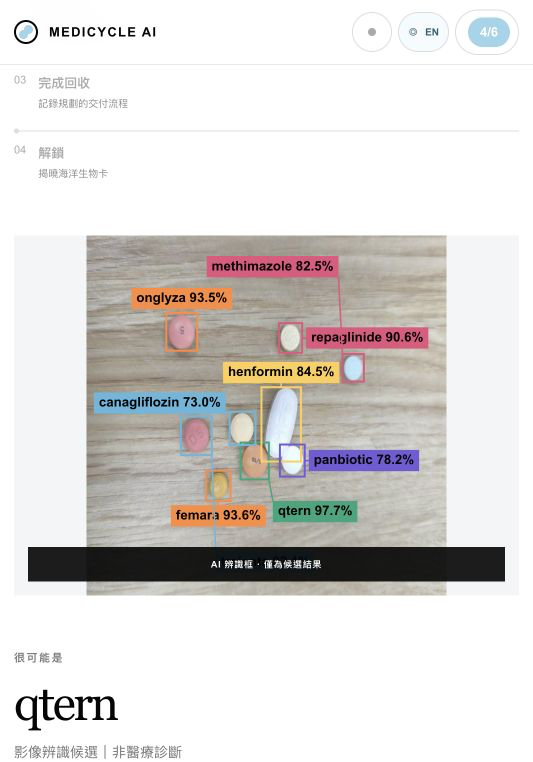
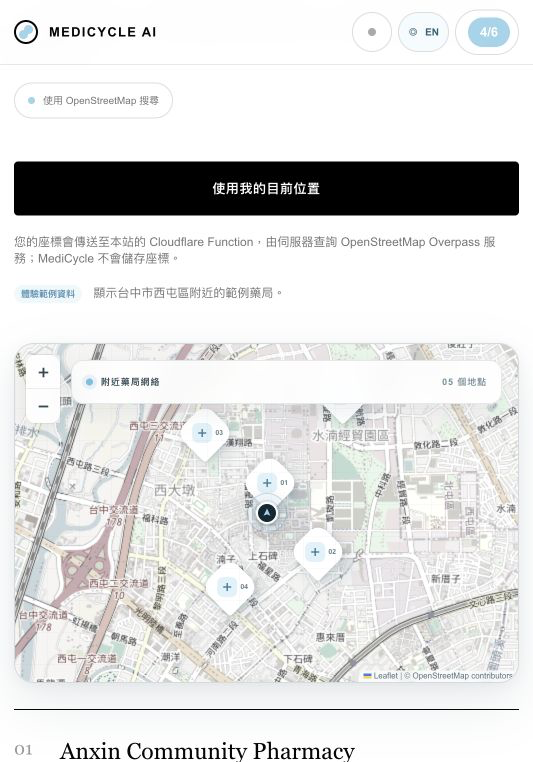
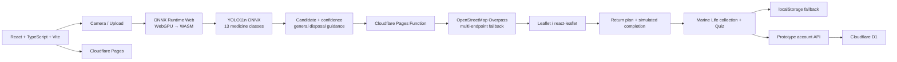

# MediCycle AI

> **Recognize the medicine. Activate better choices.**

MediCycle is a bilingual competition prototype that turns medication disposal into a clear, guided action. It combines real browser-side medication recognition, disposal guidance, live nearby-pharmacy discovery, a return plan, and ocean-impact learning to connect one household decision with a wider environmental outcome.

中文摘要：MediCycle 提供全站中英文介面，使用 YOLO11n ONNX 在瀏覽器內進行真實藥物候選辨識，並結合 OpenStreetMap 附近藥局搜尋、回收計畫、Fish / Ocean 收藏及附可信來源的詳細測驗解析。辨識結果僅供候選參考，不是醫療診斷。


## Product Walkthrough

### Real browser inference / 真實瀏覽器辨識

The included YOLO11n ONNX model analyzes the selected photo on-device. The real result below was produced by MediCycle in the browser from a user-provided medicine photo; it shows the rendered bounding boxes, medicine-name candidates, and confidence scores. Results are deliberately framed as candidates—never diagnosis, dosing, or treatment advice—and connect only to general medication-return education.



### Nearby Pharmacy / 附近藥局

Nearby Pharmacy uses browser geolocation and a same-origin Cloudflare Pages Function to query real OpenStreetMap Overpass data. Results are shown on an interactive Leaflet map, sorted nearest first, and retain the original OSM names and addresses. A location is a nearby pharmacy—not a verified medication take-back point—so the user is asked to contact it before visiting. The screenshot below uses the clearly labeled sample-data mode so it does not imply verified take-back availability.



### Fish / Ocean collection

Planning a return and recording the guided hand-off unlocks marine-life cards. My Ocean turns the environmental consequence of a small household action into visible, persistent progress.


## Features

- **Live browser inference** — runs the included YOLO11n ONNX model with WebGPU when available and automatically falls back to WASM.
- **Camera and upload** — supports camera capture, file selection, drag-and-drop, local preview, file-type validation, and a 10 MB size limit. Selected images are analyzed locally and are not uploaded or stored by MediCycle.
- **AI medication-name candidates** — decodes the image, letterboxes it to `640 × 640`, creates an RGB NCHW Float32 tensor normalized to `0–1`, parses the `1 × 17 × 8400` YOLO11 output, applies confidence filtering and class-aware NMS, restores boxes to original image coordinates, and draws the detections.
- **Bilingual product** — the full interface, recognition guidance, pharmacy flow, return plan, collection, and Quiz are available in English and Traditional Chinese.
- **Disposal and return plan** — explains why responsible disposal matters, helps the user choose a pharmacy to contact, records a return option, and guides the simulated hand-off.
- **Nearby pharmacies** — sends browser geolocation to a same-origin Cloudflare Pages Function, which validates coordinates and queries multiple OpenStreetMap Overpass providers before returning normalized nearest-first results to the Leaflet map.
- **Marine Life collection** — rewards simulated completion with six unlockable species cards and environmental impact stories.
- **Six-question Quiz** — checks pharmaceutical-pollution, disposal, aquatic-impact, and AI-role knowledge. Every submitted answer includes a bilingual detailed explanation, why the correct option is right, why the other options do not fit, and clickable sources from organizations and research databases such as the US EPA, FDA, USGS, and PubMed.
- **Prototype account** — uses a phone number and six-digit PIN (not SMS verification) to restore progress across devices. Phone and PIN values are never stored in plaintext; D1 stores a keyed phone hash and a salted PBKDF2 PIN derivation.
- **Resilient progress** — synchronizes Marine Life, Quiz, return-plan, and demo-completion progress to Cloudflare D1 while retaining `localStorage` as an offline fallback.

## How It Works

1. Take a medicine photo or upload an image from the device.
2. Analyze the image locally in the browser.
3. Review the medicine-name candidate, confidence, bounding boxes, and general disposal guidance.
4. Find nearby pharmacies through a live OpenStreetMap search or use the clearly labeled sample locations.
5. Select a pharmacy to contact, then plan and simulate completion of the medication hand-off.
6. Unlock a Marine Life card and save collection progress on the device.
7. Complete the Quiz to connect responsible disposal with its potential effect on aquatic ecosystems.

## Technical Architecture



`src/inference/yolo.ts` owns the browser inference pipeline and enforces the expected model contract: input `1 × 3 × 640 × 640`, output `1 × 17 × 8400`, and the fixed 13-class order documented below.

## Tech Stack

| Layer | Technology | Current role |
| --- | --- | --- |
| UI | React 19 | Component-based user journey and interaction state |
| Language | TypeScript | Typed application, pharmacy, quiz, and inference logic |
| Build tool | Vite | Local development and optimized static production build |
| Hosting | Cloudflare Pages | Static deployment from the GitHub `main` branch |
| Mapping | Leaflet + react-leaflet | Interactive pharmacy map, markers, popups, and map focus |
| Location data | Pages Function + OpenStreetMap Overpass | Validates coordinates, expands 2/5/10 km, retries public instances, normalizes and sorts results |
| Account persistence | Cloudflare D1 | Stores hashed account credentials, sessions, and cross-device progress |
| Offline persistence | `localStorage` | Stores non-identifying progress on the current device; never stores the phone number |
| Browser inference | ONNX Runtime Web | WebGPU-first inference with a WASM fallback |
| Vision model | YOLO11n ONNX | 13-class medication detector, 640 × 640 input, ONNX opset 17 |

## Model Card

| Item | Current value |
| --- | --- |
| Architecture | Ultralytics YOLO11n object detector |
| Classes | 13 medication classes |
| Input | `1 × 3 × 640 × 640` RGB NCHW Float32 |
| ONNX size | Approximately 10.1 MB (`10,613,686` bytes in this repository) |
| Browser execution | ONNX Runtime Web; WebGPU first, WASM fallback |
| Reference WebGPU inference | Approximately 410 ms in the existing test environment; hardware, browser, warm-up, and image conditions affect timing |
| Test mAP50 | Approximately 0.844 |
| Test mAP50–95 | Approximately 0.592 |

These evaluation metrics describe performance on the model's test dataset; they do not establish clinical accuracy or safety. MediCycle presents detections as medication-name candidates with confidence scores. It must not be used to diagnose a condition, decide treatment, determine dosage, or start, stop, or change medication. Confirm the medicine from its original packaging or with a qualified professional.

## Current Status

MediCycle is a **prototype / competition demo**, not a production medical identification service.

| Area | Status |
| --- | --- |
| Responsive UX and guided demo flow | Complete for the prototype |
| Camera/upload and local inference | Complete |
| Confidence policy and detection overlay | Complete |
| Cloudflare Pages deployment | Connected to the GitHub `main` branch; static UI and Pages Functions share one deployment target |
| Nearby Pharmacy | Real OSM/Overpass search and Leaflet map implemented with 2/5/10 km expansion and multi-provider fallback; take-back availability remains unverified |
| English / Traditional Chinese | Complete across the main product flow, including pharmacy search and Quiz explanations |
| Prototype account and D1 progress sync | Account/session/progress APIs and migration implemented; deployment still requires the `DB` binding, migration, and pepper secret described below |
| Marine Life collection and offline progress | Complete |
| Return plan and guided completion | Complete for the prototype |
| Six-question Quiz, scoring, restart, detailed explanations, and trusted links | Complete |
| ONNX preprocessing and inference module | Integrated |
| YOLO11n medication model | Included at `public/models/best.onnx` |
| Medication-name candidates | Enabled; explicitly not a diagnosis |

The prototype does not provide medical advice. Medicine identity and local disposal requirements should be confirmed with a qualified professional or authorized collection program.

## Local Development

Requirements: a current Node.js and npm installation.

```bash
npm install
npm run dev
```

Before submitting a change, run both project checks:

```bash
npm run build
npm run lint
npm run sanity:inference
```

The Vite server is sufficient for UI-only work. The production build is written to `dist/`. To run the account and pharmacy APIs locally, copy `wrangler.local.jsonc` to `wrangler.jsonc` without committing it, add a local `PHONE_HASH_PEPPER` (at least 24 random characters) to `.dev.vars`, apply `migrations/0001_accounts_and_progress.sql`, and run `npx wrangler pages dev`. Both `.dev.vars` and Wrangler's local D1 state are ignored by Git.

## Deployment

Cloudflare Pages is the deployment target and automatically builds updates from the GitHub `main` branch. The repository includes the D1 account/progress APIs and migration; a Pages environment needs the `DB` binding, applied migration, and secret below before those APIs can serve account requests.

| Setting | Value |
| --- | --- |
| Production branch | `main` |
| Build command | `npm run build` |
| Build output directory | `dist` |

### Required Cloudflare configuration

1. Create a D1 database named `medicycle-progress`.
2. Open its Console and execute `migrations/0001_accounts_and_progress.sql`.
3. In the MediCycle Pages project's production and preview settings, add a D1 binding named exactly `DB` and select `medicycle-progress`.
4. Add an encrypted secret named exactly `PHONE_HASH_PEPPER` to production and preview. Use a cryptographically random value of at least 32 bytes and never put it in Git or frontend environment variables.
5. Set the Pages compatibility date to `2026-09-04` or newer and enable `nodejs_compat` for production and preview.
6. Keep the existing build command `npm run build`, output directory `dist`, and production branch `main`, then trigger a new deployment.

### Pages Function endpoints

| Endpoint | Method | Purpose |
| --- | --- | --- |
| `/api/auth/register` | `POST` | Create a prototype account and merge device progress |
| `/api/auth/login` | `POST` | Verify phone + PIN, create an HttpOnly session, and merge/restore progress |
| `/api/auth/logout` | `POST` | Revoke only the current session; saved progress remains |
| `/api/progress` | `GET` | Restore the signed-in user's progress |
| `/api/progress` | `PUT` | Merge and save progress |
| `/api/progress` | `DELETE` | Reset progress without deleting the account |
| `/api/pharmacies?lat=…&lon=…` | `GET` | Return normalized nearest pharmacies through the server-side Overpass fallback |

## Model Integration Notes

The browser model must be stored at `public/models/best.onnx`. If the binary is omitted from a branch or deployment artifact, copy the exported ONNX file to that exact path before building or deploying. `public/models/classes.json` documents the fixed class order; the same order is also enforced in code.

Confidence policy:

- `>= 0.70`: **Likely match / 很可能是**
- `0.50–0.70`: **Possible match / 可能是**
- `< 0.50` or no detection: **Unable to identify reliably / 無法可靠辨識**, with a request to retake the photo

The fixed class order is: `canagliflozin`, `femara`, `henformin`, `januvia`, `kombiglyze`, `methimazole`, `nolvadex`, `onglyza`, `oseni`, `panbiotic`, `qtern`, `repaglinide`, `trajenta`.
